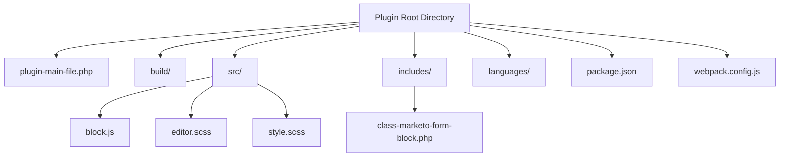

# Marketo Form Gutenberg Block Plugin - Implementation Plan

## 1. Plugin Structure and Setup



### Key Files and Their Purposes:

- **plugin-main-file.php**: Main plugin file with WordPress plugin header, initialization, and registration
- **src/block.js**: JavaScript for registering and defining the Gutenberg block
- **src/editor.scss**: Styles for the block in the editor
- **src/style.scss**: Styles for the block on the frontend
- **includes/class-marketo-form-block.php**: PHP class for server-side functionality
- **package.json**: NPM dependencies and scripts
- **webpack.config.js**: Webpack configuration for building the block

## 2. Development Phases

### Phase 1: Plugin Foundation (1-2 hours)
- Set up plugin directory structure
- Create main plugin file with proper WordPress headers
- Register necessary hooks for initialization
- Set up build process with webpack

### Phase 2: Gutenberg Block Development (3-4 hours)
- Create block registration script
- Implement block edit component with form ID and redirect URL inputs
- Develop block inspector controls for additional settings
- Implement save function for the block

### Phase 3: Marketo Integration (2-3 hours)
- Implement Marketo Forms 2.0 JavaScript API integration
- Create functions to load Marketo forms based on form ID
- Handle form submission and redirect functionality
- Implement form validation
- **Add option to remove default Marketo styling**

### Phase 4: Custom CSS Implementation (2-3 hours)
- Add textarea for custom CSS input in block settings
- Create mechanism to apply custom CSS to Marketo forms
- Implement option to disable default Marketo styling
- Add CSS specificity handling to ensure custom styles take precedence
- Create CSS scoping to prevent conflicts with theme styles

### Phase 5: Advanced Features (2-3 hours)
- Add custom success/error message handling
- Implement form validation on both client and server side
- Create settings for customizing form behavior

### Phase 6: Testing and Refinement (1-2 hours)
- Test the plugin in different WordPress environments
- Verify Marketo form loading and submission
- Test validation and error handling
- Test custom CSS application
- Optimize performance and fix any issues

## 3. Technical Implementation Details

### Gutenberg Block Registration

```javascript
registerBlockType('marketo-form-block/form', {
    title: 'Marketo Form',
    icon: 'feedback',
    category: 'widgets',
    attributes: {
        formId: {
            type: 'string',
            default: '',
        },
        redirectUrl: {
            type: 'string',
            default: '',
        },
        successMessage: {
            type: 'string',
            default: 'Thank you for your submission!',
        },
        errorMessage: {
            type: 'string',
            default: 'There was an error processing your submission. Please try again.',
        },
        customCSS: {
            type: 'string',
            default: '',
        },
        disableDefaultStyles: {
            type: 'boolean',
            default: true,
        },
        // Additional attributes for validation
    },
    edit: EditComponent,
    save,
});
```

### Marketo Form Integration with Custom CSS Support

```javascript
// In the frontend script
function loadMarketoForm(formId, redirectUrl, successMessage, errorMessage, customCSS, disableDefaultStyles) {
    // If disabling default styles is enabled
    if (disableDefaultStyles) {
        // Add a flag to disable default Marketo styling
        window.MktoForms2.whenReady(function(form) {
            // Remove default Marketo styles
            form.getFormElem().find('style').remove();
        });
    }
    
    // Apply custom CSS if provided
    if (customCSS) {
        const styleElement = document.createElement('style');
        styleElement.type = 'text/css';
        styleElement.innerHTML = customCSS;
        document.head.appendChild(styleElement);
    }
    
    MktoForms2.loadForm("//app-example.marketo.com", "XXX-YYY-ZZZ", formId, (form) => {
        // Form loaded callback
        
        // Add validation
        form.onValidate(function(isValid) {
            // Custom validation logic
        });
        
        // Add success handler
        form.onSuccess(function(values, followUpUrl) {
            // Display success message
            document.getElementById('mktoFormSuccess').innerHTML = successMessage;
            
            // Handle redirect
            if (redirectUrl) {
                setTimeout(function() {
                    window.location.href = redirectUrl;
                }, 1000);
            }
            
            // Return false to prevent the default form submission
            return false;
        });
    });
}
```

### Block Edit Component with Custom CSS Options

```javascript
const EditComponent = (props) => {
    const { attributes, setAttributes } = props;
    const { 
        formId, 
        redirectUrl, 
        successMessage, 
        errorMessage, 
        customCSS, 
        disableDefaultStyles 
    } = attributes;
    
    return (
        <div className={props.className}>
            <InspectorControls>
                <PanelBody title="Form Settings">
                    <TextControl
                        label="Marketo Form ID"
                        value={formId}
                        onChange={(value) => setAttributes({ formId: value })}
                    />
                    <TextControl
                        label="Redirect URL"
                        value={redirectUrl}
                        onChange={(value) => setAttributes({ redirectUrl: value })}
                    />
                    <TextareaControl
                        label="Success Message"
                        value={successMessage}
                        onChange={(value) => setAttributes({ successMessage: value })}
                    />
                    <TextareaControl
                        label="Error Message"
                        value={errorMessage}
                        onChange={(value) => setAttributes({ errorMessage: value })}
                    />
                </PanelBody>
                
                <PanelBody title="Styling Options">
                    <ToggleControl
                        label="Disable Default Marketo Styles"
                        checked={disableDefaultStyles}
                        onChange={(value) => setAttributes({ disableDefaultStyles: value })}
                        help="Enable this to remove Marketo's default styling and allow your theme styles to take precedence."
                    />
                    <TextareaControl
                        label="Custom CSS"
                        value={customCSS}
                        onChange={(value) => setAttributes({ customCSS: value })}
                        help="Enter custom CSS to style the Marketo form. Use .mktoForm as the parent selector."
                        rows={8}
                    />
                </PanelBody>
            </InspectorControls>
            
            <div className="marketo-form-placeholder">
                <p>Marketo Form: {formId || 'No form selected'}</p>
                {formId ? (
                    <div>
                        <p>Form ID: {formId}</p>
                        <p>Redirect URL: {redirectUrl || 'None'}</p>
                        <p>Custom Styling: {customCSS ? 'Applied' : 'None'}</p>
                        <p>Default Styles: {disableDefaultStyles ? 'Disabled' : 'Enabled'}</p>
                    </div>
                ) : (
                    <p>Please enter a Marketo Form ID in the block settings.</p>
                )}
            </div>
        </div>
    );
};
```

### Server-Side Rendering for Custom CSS

```php
/**
 * Server-side rendering of the Marketo form block
 */
function render_marketo_form_block($attributes) {
    $form_id = isset($attributes['formId']) ? $attributes['formId'] : '';
    $redirect_url = isset($attributes['redirectUrl']) ? $attributes['redirectUrl'] : '';
    $success_message = isset($attributes['successMessage']) ? $attributes['successMessage'] : '';
    $error_message = isset($attributes['errorMessage']) ? $attributes['errorMessage'] : '';
    $custom_css = isset($attributes['customCSS']) ? $attributes['customCSS'] : '';
    $disable_default_styles = isset($attributes['disableDefaultStyles']) ? $attributes['disableDefaultStyles'] : true;
    
    if (empty($form_id)) {
        return '<p>Please specify a Marketo Form ID.</p>';
    }
    
    // Generate a unique ID for this form instance
    $form_container_id = 'mkto-form-' . uniqid();
    
    // Start output buffering
    ob_start();
    
    // Custom CSS if provided
    if (!empty($custom_css)) {
        echo '<style type="text/css">' . esc_html($custom_css) . '</style>';
    }
    
    // Form container
    echo '<div id="' . esc_attr($form_container_id) . '" class="marketo-form-container"></div>';
    echo '<div id="mktoFormSuccess" class="marketo-form-success"></div>';
    
    // JavaScript to load the form
    ?>
    <script type="text/javascript">
        document.addEventListener('DOMContentLoaded', function() {
            if (typeof MktoForms2 !== 'undefined') {
                <?php if ($disable_default_styles) : ?>
                // Disable default Marketo styles
                MktoForms2.whenReady(function(form) {
                    form.getFormElem().find('style').remove();
                });
                <?php endif; ?>
                
                // Load the form
                MktoForms2.loadForm("//app-example.marketo.com", "XXX-YYY-ZZZ", "<?php echo esc_js($form_id); ?>", function(form) {
                    // Success handler
                    form.onSuccess(function(values, followUpUrl) {
                        document.getElementById('mktoFormSuccess').innerHTML = "<?php echo esc_js($success_message); ?>";
                        
                        <?php if (!empty($redirect_url)) : ?>
                        // Redirect if URL is provided
                        setTimeout(function() {
                            window.location.href = "<?php echo esc_js($redirect_url); ?>";
                        }, 1000);
                        <?php endif; ?>
                        
                        return false;
                    });
                });
            } else {
                console.error('Marketo Forms 2.0 API not loaded');
                document.getElementById('<?php echo esc_js($form_container_id); ?>').innerHTML = 
                    '<p>Error: Marketo Forms API not loaded. Please check your configuration.</p>';
            }
        });
    </script>
    <?php
    
    // Return the buffered content
    return ob_get_clean();
}
```

## 4. Required Dependencies

- **@wordpress/scripts**: For build process and WordPress components
- **@wordpress/components**: For UI components in the block editor
- **@wordpress/blocks**: For block registration and utilities
- **@wordpress/i18n**: For internationalization
- **@wordpress/block-editor**: For block editor components
- **sass**: For SCSS compilation
- **webpack**: For bundling JavaScript and CSS

## 5. Potential Challenges and Solutions

### Challenge 1: Marketo Forms Loading Timing
**Solution**: Implement a check to ensure Marketo Forms 2.0 API is loaded before attempting to load the form, with a fallback mechanism.

### Challenge 2: CSS Specificity Issues
**Solution**: Use a combination of !important declarations and higher specificity selectors when necessary to override Marketo's default styles. Provide documentation on CSS selector patterns for common form elements.

### Challenge 3: Form Styling Consistency Across Themes
**Solution**: Provide a base set of CSS reset rules that can be applied when disabling default styles to ensure consistent starting point.

### Challenge 4: Block Editor Preview Limitations
**Solution**: Create a representative placeholder in the editor that shows the form settings without actually loading the Marketo form.

### Challenge 5: WordPress Version Compatibility
**Solution**: Test with multiple WordPress versions and implement version checks for Gutenberg-specific features.

## 6. Testing Strategy

1. **Unit Testing**: Test individual functions for form loading and validation
2. **Integration Testing**: Test the block in the WordPress editor
3. **End-to-End Testing**: Test the complete form submission process
4. **Cross-Browser Testing**: Ensure compatibility with major browsers
5. **Responsive Testing**: Verify the form works well on different screen sizes
6. **CSS Testing**: Verify custom CSS is properly applied and default styles are removed when specified